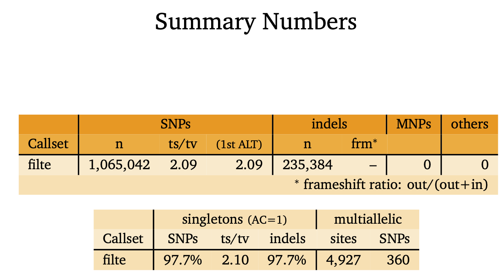
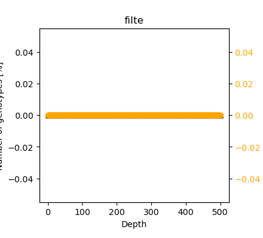
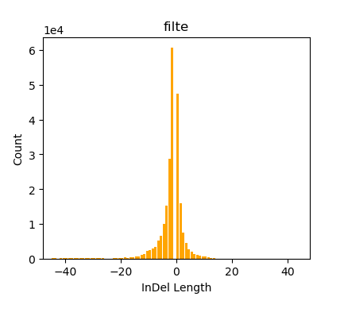
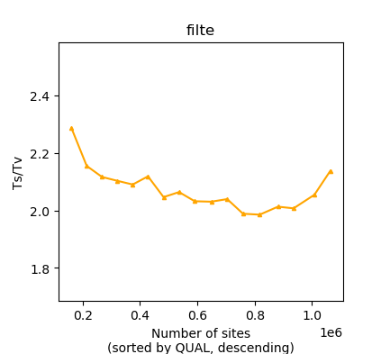
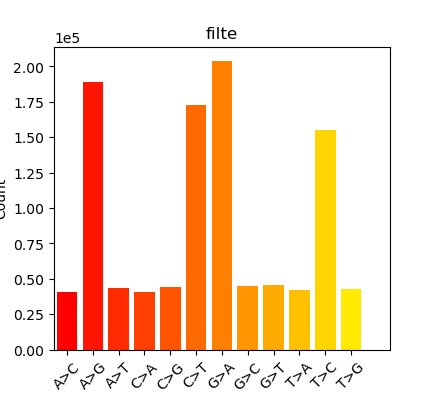

# Identifying SNPs
In this section we first identify SNPs from the reads aligned to the Super Transcripts reference fasta file. the full pipeline is described here https://github.com/trinityrnaseq/trinityrnaseq/wiki/Variant-Calling. This pipeline is well established, and other work has actually found that the Trinity + STAR + GATK pipeline produces the best variant calls (e.g., see [Zhao et al. 2019](https://doi.org/10.1186/s12864-019-5533-4)). After calling SNPs, we perform a series of steps in order to generate a set of high-quality candidate SNPs and flanking regions to be submitted to the Sequenom genotyping facility.

## Step 1:  Running Trinity's built-in GATK pipeline on the Super Transcripts
See the full pipeline here: https://github.com/trinityrnaseq/trinityrnaseq/wiki/Variant-Calling

Dependencies that need to be installed:  
  - [Picard v2.23.0](https://broadinstitute.github.io/picard/)
    - `wget https://github.com/broadinstitute/picard/releases/download/2.23.0/picard.jar`
  - [STAR v2.7.3a](https://github.com/alexdobin/STAR)
  - [samtools v1.9](https://samtools.github.io)
  - [GATK v4.1.7.0](https://gatk.broadinstitute.org/hc/en-us)
    - `wget https://github.com/broadinstitute/gatk/releases/download/4.1.7.0/gatk-4.1.7.0.zip`
    - `unzip gatk-4.1.7.0.zip`

_Setup Picard and GATK environmental variables_
```bash
export PICARD_HOME=/home/rfitak/.bin/
export GATK_HOME=/home/rfitak/PROGRAMS/gatk-4.1.7.0
```

_Run SNP-calling Pipeline_
```bash
# Merge read files together
cat \
   HOWR-1_cleaned.cor.unfixrm.rmrRNA.fq.1.gz \
   HOWR-2_cleaned.cor.unfixrm.rmrRNA.fq.1.gz > left.fq.gz
cat \
   HOWR-1_cleaned.cor.unfixrm.rmrRNA.fq.2.gz \
   HOWR-2_cleaned.cor.unfixrm.rmrRNA.fq.2.gz > right.fq.gz

# Run Trinity SNP Pipeline
run_variant_calling.py \
   --st_fa ./trinity1/Trinity.SuperTrans.fasta \
   --st_gtf ./trinity1/Trinity.SuperTrans.gtf \
   -p left.fq.gz right.fq.gz \
   -o ./SNPS \
   -l 150 \
   -t 32 \
   -m 512000000000

rm -rf left.fq.gz right.fq.gz
```

**See various output and log files from the code above:**
- [snp-calling.err](./Data/snp-calling.err)
- [variant_calling.log](./Data/variant_calling.log)
- [Log.out](./Data/Log.out)
- [Log.final.out](./Data/Log.final.out)

## SNP output summary
The final set of called SNPs are in the output file `filtered_output.vcf`.  In total,** 2,200,840** variants were identified (including SNPs, indels, etc).  However, not all these SNPs are of high quality.  The pipeline above does filter SNPs using GATK's `VariantFiltration` engine and the following criteria:
- `-window 35`
  - The window size (in bases) in which to evaluate clustered SNPs
- `-cluster 3`
  - The number of SNPs which make up a cluster.
- `--filter-name FS -filter "FS > 30.0"`
  - Strand bias estimated using Fisher's Exact Test. Strand bias is a type of sequencing bias in which one DNA strand is favored over the other, which can result in incorrect evaluation of the amount of evidence observed for one allele vs. the other. The FisherStrand (FS) annotation is one of several methods that aims to evaluate whether there is strand bias in the data. It uses Fisher's Exact Test to determine if there is strand bias between forward and reverse strands for the reference or alternate allele. The output is a Phred-scaled p-value. The higher the output value, the more likely there is to be bias. More bias is indicative of false positive calls.
  - FS > 30 means a P-value for bias < 0.001
- `--filter-name QD -filter "QD < 2.0"`
  - The QD is the QUAL score normalized by allele depth (AD) for a variant
  - This annotation puts the variant confidence QUAL score into perspective by normalizing for the amount of coverage available. Because each read contributes a little to the QUAL score, variants in regions with deep coverage can have artificially inflated QUAL scores, giving the impression that the call is supported by more evidence than it really is. To compensate for this, we normalize the variant confidence by depth, which gives us a more objective picture of how well supported the call is.

All variants in `filtered_output.vcf` are labeled as either `PASS` (passing all the above criteria), or has one or more of the labels `QD`, `SnpCluster`, and `FS` when they don't pass that specific filter above. Below is a summary of the variants based on the filtering criteria.  In total, **1,299,784** (59.1%) variants passed the filter.
```bash
# Find the number of SNPs matching each filter label
grep -v "^#" filtered_output.vcf | cut -f7 | sort | uniq -c

# Output
   2340 FS
    603 FS;QD
    308 FS;QD;SnpCluster
   1674 FS;SnpCluster
1299784 PASS
 200579 QD
  93293 QD;SnpCluster
 602259 SnpCluster
```

_Here are some additional summary stats and plots for "PASS" SNPs_
```bash
# Get summary stats using bcftools
bcftools stats -f 'PASS' filtered_output.vcf > out.ck

# Plot results
plot-vcfstats -p SNP-STATS out.ck
```


|||
| --- | --- |
|||

## Step 2:  Additional SNP filtering
This section passes all the variants through additional checks to identify a final set of robust SNPs to submit for Sequenom genotyping.
